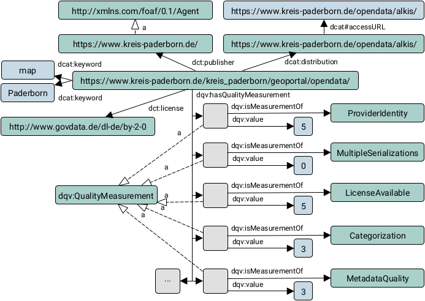

# OPAL Civet

OPAL metadata quality component.


## Usage with Apache Maven

Add the following lines to your `pom.xml` configuration file:

	<dependencies>
		<dependency>
			<groupId>org.dice-research.opal</groupId>
			<artifactId>civet</artifactId>
			<version>[2,3)</version>
		</dependency>
	</dependencies>
	
	<repositories>
		<repository>
			<id>maven.aksw.internal</id>
			<name>AKSW Repository</name>
			<url>http://maven.aksw.org/archiva/repository/internal</url>
		</repository>
		<repository>
			<id>maven.aksw.snapshots</id>
			<name>AKSW Snapshot Repository</name>
			<url>http://maven.aksw.org/archiva/repository/snapshots</url>
		</repository>
	</repositories>

Available versions are listed at [maven.aksw.org](https://maven.aksw.org/archiva/#advancedsearch~internal/org.dice-research.opal~civet~~~~~30).


## Example



```Java
import java.io.File;
import org.apache.jena.rdf.model.Model;
import org.dice_research.opal.civet.Civet;
import org.dice_research.opal.common.utilities.FileHandler;

public class Example {

	/**
	 * Computes quality metric scores (measurements).
	 * 
	 * @param turtleInputFile  A TURTLE file to read
	 * @param turtleOutputFile A TURTLE file to write results
	 * @param datasetUri       A URI of a dcat:Dataset inside the TURTLE data
	 * 
	 * @see https://www.w3.org/TR/turtle/
	 * @see https://www.w3.org/TR/vocab-dcat/
	 */
	public void evaluateMetadata(File turtleInputFile, File turtleOutputFile, String datasetUri) throws Exception {

		// Load TURTLE file into model
		Model model = FileHandler.importModel(turtleInputFile);

		Civet civet = new Civet();

		// If long running metrics should be included.
		// (optional method call, default: false)
		civet.setIncludeLongRunning(true);

		// If it should be logged, if a measurement could not be computed
		// (optional method call, default: true)
		civet.setLogIfNotComputed(false);

		// If existing measurements should be removed
		// (optional method call, default: true)
		civet.setRemoveMeasurements(true);

		// Update model
		civet.processModel(model, datasetUri);

		// Write updated model into TURTLE file
		FileHandler.export(turtleOutputFile, model);
	}
}
```

### Example input:

```Turtle
<https://www.kreis-paderborn.de/kreis_paderborn/geoportal/opendata/>
        a       <http://www.w3.org/ns/dcat#Dataset> ;
        <http://purl.org/dc/terms/accrualPeriodicity>
                "IRREG" ;
        <http://purl.org/dc/terms/license>
                "http://www.govdata.de/dl-de/by-2-0" ;
        <http://purl.org/dc/terms/publisher>
                <https://www.kreis-paderborn.de/> ;
        <http://www.w3.org/ns/dcat#distribution>
                <https://www.kreis-paderborn.de/opendata/alkis/> ;
        <http://www.w3.org/ns/dcat#keyword>
                "map" , "Paderborn" .

<https://www.kreis-paderborn.de/opendata/alkis/>
        a       <http://www.w3.org/ns/dcat#Distribution> ;
        <http://www.w3.org/ns/dcat#accessURL>
                "https://www.kreis-paderborn.de/opendata/alkis/" .
                
<https://www.kreis-paderborn.de/>
        a       <http://xmlns.com/foaf/0.1/Agent> .
```

### Example output:

```Turtle
<https://www.kreis-paderborn.de/kreis_paderborn/geoportal/opendata/>
        a       <http://www.w3.org/ns/dcat#Dataset> ;
        <http://purl.org/dc/terms/accrualPeriodicity>
                "IRREG" ;
        <http://purl.org/dc/terms/license>
                "http://www.govdata.de/dl-de/by-2-0" ;
        <http://purl.org/dc/terms/publisher>
                <https://www.kreis-paderborn.de/> ;
        <http://www.w3.org/ns/dcat#distribution>
                <https://www.kreis-paderborn.de/opendata/alkis/> ;
        <http://www.w3.org/ns/dcat#keyword>
                "map" , "Paderborn" ;
        <http://www.w3.org/ns/dqv#hasQualityMeasurement>
                [ a       <http://www.w3.org/ns/dqv#QualityMeasurement> ;
                  <http://www.w3.org/ns/dqv#isMeasurementOf>
                          <http://metric.projekt-opal.de/ProviderIdentity> ;
                  <http://www.w3.org/ns/dqv#value>
                          5
                ] ;
        <http://www.w3.org/ns/dqv#hasQualityMeasurement>
                [ a       <http://www.w3.org/ns/dqv#QualityMeasurement> ;
                  <http://www.w3.org/ns/dqv#isMeasurementOf>
                          <http://metric.projekt-opal.de/MultipleSerializations> ;
                  <http://www.w3.org/ns/dqv#value>
                          0
                ] ;
        <http://www.w3.org/ns/dqv#hasQualityMeasurement>
                [ a       <http://www.w3.org/ns/dqv#QualityMeasurement> ;
                  <http://www.w3.org/ns/dqv#isMeasurementOf>
                          <http://metric.projekt-opal.de/LicenseAvailable> ;
                  <http://www.w3.org/ns/dqv#value>
                          5
                ] ;
        <http://www.w3.org/ns/dqv#hasQualityMeasurement>
                [ a       <http://www.w3.org/ns/dqv#QualityMeasurement> ;
                  <http://www.w3.org/ns/dqv#isMeasurementOf>
                          <http://metric.projekt-opal.de/MetadataQuality> ;
                  <http://www.w3.org/ns/dqv#value>
                          3
                ] ;
        <http://www.w3.org/ns/dqv#hasQualityMeasurement>
                [ a       <http://www.w3.org/ns/dqv#QualityMeasurement> ;
                  <http://www.w3.org/ns/dqv#isMeasurementOf>
                          <http://metric.projekt-opal.de/Retrievability> ;
                  <http://www.w3.org/ns/dqv#value>
                          5
                ] ;
        <http://www.w3.org/ns/dqv#hasQualityMeasurement>
                [ a       <http://www.w3.org/ns/dqv#QualityMeasurement> ;
                  <http://www.w3.org/ns/dqv#isMeasurementOf>
                          <http://metric.projekt-opal.de/Categorization> ;
                  <http://www.w3.org/ns/dqv#value>
                          3
                ] ;
        <http://www.w3.org/ns/dqv#hasQualityMeasurement>
                [ a       <http://www.w3.org/ns/dqv#QualityMeasurement> ;
                  <http://www.w3.org/ns/dqv#isMeasurementOf>
                          <http://metric.projekt-opal.de/DataFormat> ;
                  <http://www.w3.org/ns/dqv#value>
                          0
                ] ;
        <http://www.w3.org/ns/dqv#hasQualityMeasurement>
                [ a       <http://www.w3.org/ns/dqv#QualityMeasurement> ;
                  <http://www.w3.org/ns/dqv#isMeasurementOf>
                          <http://metric.projekt-opal.de/UpdateRate> ;
                  <http://www.w3.org/ns/dqv#value>
                          1
                ] .

<https://www.kreis-paderborn.de/opendata/alkis/>
        a       <http://www.w3.org/ns/dcat#Distribution> ;
        <http://www.w3.org/ns/dcat#accessURL>
                "https://www.kreis-paderborn.de/opendata/alkis/" .
                
<https://www.kreis-paderborn.de/>
        a       <http://xmlns.com/foaf/0.1/Agent> .
```


## How to add additional metrics

Metrics have to implement the interface [Metric](src/main/java/org/dice_research/opal/civet/Metric.java).
To add an implemented metric, use the [getMetrics()](src/main/java/org/dice_research/opal/civet/Civet.java#L93) method.
Tests should be added to [AllTests](src/test/java/org/dice_research/opal/civet/AllTests.java) test suite.


## Note

Civet version 1 can be found at [branch civet-version-1](https://github.com/projekt-opal/civet/tree/civet-version-1).


## Credits

[Data Science Group (DICE)](https://dice-research.org/) at [Paderborn University](https://www.uni-paderborn.de/)

This work has been supported by the German Federal Ministry of Transport and Digital Infrastructure (BMVI) in the project [Open Data Portal Germany (OPAL)](http://projekt-opal.de/) (funding code 19F2028A).
